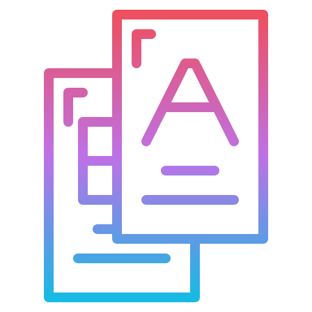

#  Preplit
## Executive Summary
This project gives a brief overview of "Preplit", created on May 22, 2025, with the goal of having a simple visual flashcard directory for any sort of preparation. The project meets to satisfy user preference for studying with flashcards.

Key functionalities include creating categories used for organizing flashcards created and stored inside their respective categories. Admin users can also maintain the site and ensure no harmful data enter the site as a part of site moderation.

The proposed development approach utilizes a waterfall methodology, ensuring productivity and iterative progress with feedback integration anticipates completing the service by June 17, 2025 (tentative). A brief demo is scheduled for the due date.

Potential risks identified include the storage of personal information for our users. Mitigation strategies, including necessary security implementations in a remote database, will be in place to address these risks.

The project aims to deliver a high-quality, impactful solution that meets the strategic objectives of the organization. We look forward to the opportunity to partner with you on this transformative initiative.

## Key Functionalities

* **Basic Flashcard Organization:** Flashcards can get organized by the system to the category they were created in.
* **Cloud Saving:** Users can have their information automatically saved to the cloud database so long as they have an account with the site.
* **Admin Privileges:** Admins can manage any data processed in the entire database, including users, categories, and cards.

## Development Approach

The project is being developed using a **Waterfall methodology**. This approach ensures a structured and sequential development process, allowing for clear milestones and iterative progress. Feedback integration will be incorporated at key stages to ensure the final product aligns with requirements.

**Tentative Completion Date:** June 17, 2025

## Potential Risks and Mitigation Strategies

A key potential risk identified is the storage of personal information for both staff and customers. To mitigate this, the following strategies will be implemented:

* **Dedicated Database:** All sensitive information will be stored in a remote and secure database.
* **Security Implementations:** Industry-standard security measures, including encryption and access controls, will be implemented to protect data integrity and confidentiality.

## Getting Started
* Enter the Preplit site (https://preplit-fbg3d5hgecetekhj.westus2-01.azurewebsites.net/)
* Register, then log in with your email and password
* Go to the category list and create a category
* Select the created category, then create a card contianing a question and answer; they will be on different sides.

## API Endpoints
This section lists the available API endpoints and their functionalities, including:

* `/categories`: For retrieving and manipulating created categories
* `/cards`: For retrieving and manipulating created cards.
* `/auth`: For handling user authentication.
* `/user`: For handling user authorization while interacting with the website and admin management with users.

## Technologies Used
This section lists the technologies and frameworks used in the development of this API and website, including:

* Programming Language (C#, TypeScript)
* Web Framework (ASP.NET Core)
* Database (SQLServer)
* Cloud Platform (Azure)
* Web Tooling (HTML/CSS)
* Web Libraries (React, Material UI)

## License (Future Considerations)

This project is a part of the GNU General Public License v3.0

## Contact

For any inquiries, please contact:

* Lucas Rodriguez
* lucasrodriguez1002@proton.me
